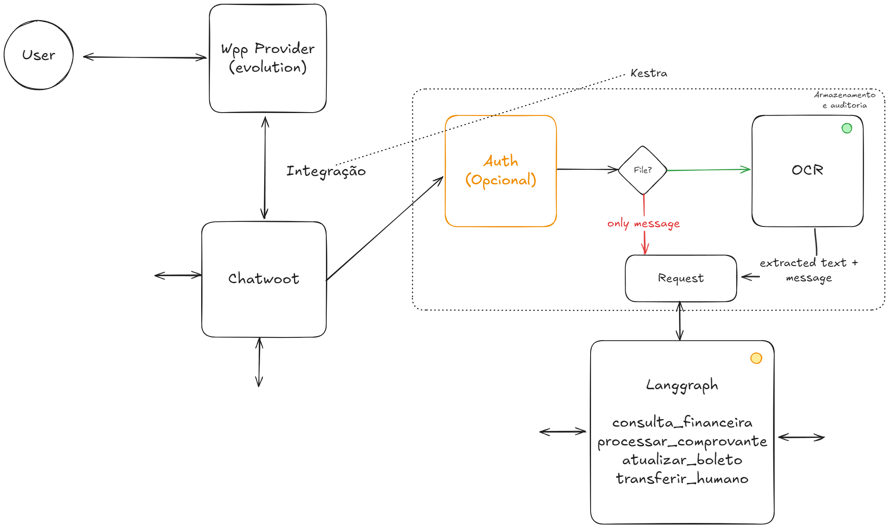

# Sistemas agênticos
Como transformar IA em vantagem competitiva e driblar o caminho de virar só mais um custo operacional

## Entendendo o que são Sistemas Agênticos

### Classificação Sistemas Agênticos
Um **workflow** é mais determinístico e mais previsível, um **agente** por sua vez é menos determinístico e menos previsível. O que isso significa? Dificilmente um sistema agêntico atinge 100% de eficácia, a regra **80/20** se aplicaria muito bem aqui, 20% do esforço para atingir 80% dos casos, enquanto 80% do esforço seria para conseguir atingir os 20% dos casos restantes.

> - Fluxos de trabalho (Workflow) são sistemas onde LLMs e ferramentas são orquestrados por meio de caminhos de código predefinidos.
> - Agentes (Agents), por outro lado, são sistemas onde os LLMs direcionam dinamicamente seus próprios processos e uso de ferramentas, mantendo o controle sobre como realizam tarefas.
>
> *Anthropic, 19 de dezembro de 2024* - [Link do artigo](https://www.anthropic.com/engineering/building-effective-agents)

#### Workflow

#### Agent

*Exemplo Lucas PM NorthAI*

### Consequências

- Construção de backlog confusa
- Análise de requisitos insuficientes
- Acréscimo no tempo de desenvolvimento

## Planejando implementação de IA

### Passo a passo

*Langchain, 9 de julho de 2025*

[Link do artigo](https://blog.langchain.com/how-to-build-an-agent/)

## Construindo agentes eficazes

### Quando (e quando não) usar agentes - Tradeoff
> Ao desenvolver aplicações com LLMs, recomendamos encontrar a solução mais simples possível e aumentar a complexidade apenas quando necessário. Isso pode significar não desenvolver sistemas agenticos. Sistemas agenticos frequentemente trocam latência e custo por melhor desempenho de tarefas, e você deve considerar quando essa troca faz sentido.
> 
> Quando maior complexidade é necessária, os fluxos de trabalho oferecem previsibilidade e consistência para tarefas bem definidas, enquanto os agentes são a melhor opção quando flexibilidade e tomada de decisão orientada por modelos são necessárias em escala. Para muitas aplicações, no entanto, otimizar chamadas LLM individuais com exemplos de recuperação e contexto geralmente é suficiente.
>
>> *Anthropic, 19 de dezembro de 2024*
> 
> Sinais de alerta a evitar:
>
> - Se você não consegue dar exemplos concretos, seu escopo provavelmente é muito amplo.
> - Usar um agente quando um software tradicional funcionaria melhor (por exemplo, quando a lógica é simples, fixa e já implementada em outro lugar).
> - Agentes são lentos, caros e podem ser complicados às vezes. Se um software tradicional resolver o problema, use-o!
> - Esperar uma mágica que não existe (por exemplo, conectar-se a APIs ou conjuntos de dados que não existem ou que ainda não podem ser construídos)
> 
> *Langchain, 9 de julho de 2025*

### Intents

Intents em sistemas agênticos são as intenções ou objetivos específicos que um agente busca alcançar, representando o que o agente pretende fazer ou o resultado que deseja obter através de suas ações.

### Frameworks

> Essas estruturas facilitam o início, simplificando tarefas padrão de baixo nível, como chamar LLMs, definir e analisar ferramentas e encadear chamadas. No entanto, elas frequentemente criam camadas extras de abstração que podem obscurecer os prompts e respostas subjacentes, dificultando a depuração. Elas também podem tornar tentador adicionar complexidade quando uma configuração mais simples seria suficiente.
>
> 1. Mantenha a simplicidade no design do seu agente.
> 2. Priorize a transparência mostrando explicitamente as etapas de planejamento do agente.
> 3. Crie cuidadosamente sua interface agente-computador (ACI) por meio de documentação e testes completos de ferramentas .
>
> *Langchain, 9 de julho de 2025*

### Evaluation

Evaluation em sistemas agênticos é o processo de medir e analisar o desempenho, eficácia e qualidade das ações e decisões tomadas por agentes autônomos em relação aos seus objetivos e tarefas definidas.

### Human in the Loop (HIL ou HITL)

HIL (Human-in-the-Loop) em sistemas agênticos permite combinar a automação inteligente dos agentes com supervisão humana estratégica, garantindo maior confiabilidade, controle e adaptabilidade nas decisões críticas.

> No entanto, os efeitos relatados da IA ​​de geração no resultado final ainda não são relevantes em nível empresarial. Mais de 80% dos entrevistados afirmam que suas organizações não estão observando um impacto tangível no EBIT corporativo com o uso da IA ​​de geração.
>
> *McKinsey, 12 de março de 2025*
>
> Os sistemas de IA Agentic devem ter 'Human in the loop', diz executivo do Google.
>
> *Fortune, 24 de julho de 2025*

[McKinsey](https://www.mckinsey.com/capabilities/quantumblack/our-insights/the-state-of-ai)

[Fortune](https://fortune.com/2025/07/24/agentic-ai-systems-must-have-human-loop-says-google-exec-cfo/)

## NXZ Fin Agent - Fernanda

### Arquitetura

### Backlog
[Linear Project](https://linear.app/massarenti-nexuz/project/agente-financeiro-nxz-brain-1af42243f26a/issues?layout=list&ordering=priority&grouping=workflowState&subGrouping=none&showCompletedIssues=all&showSubIssues=true&showTriageIssues=false)

### Tecnologias

- ETL, Automação e Integração -> Kestra
- Orquestração de sistemas agênticos -> Langgraph e Langchain
- Tracing de sistemas agênticos e LLM -> Langsmith
- Deploy de sistemas agênticos -> Langgraph platform
- Versionamento -> Github - LLMs -> OpenRouter e OpenAI
- OCR e Storage -> GCP
- Hub omnichanel e gateway para mensagens -> Chatwoot
- WhatsApp Provider -> API Oficial, Twillio, Whatsmeow
- Infra (Apoio) -> Kubernetes & Terraform